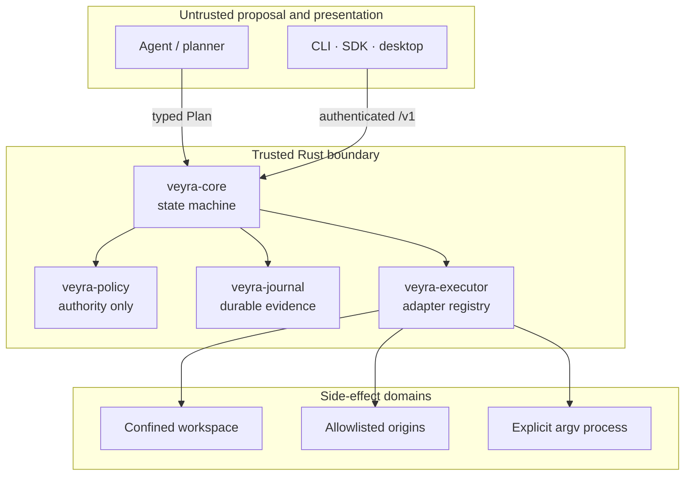
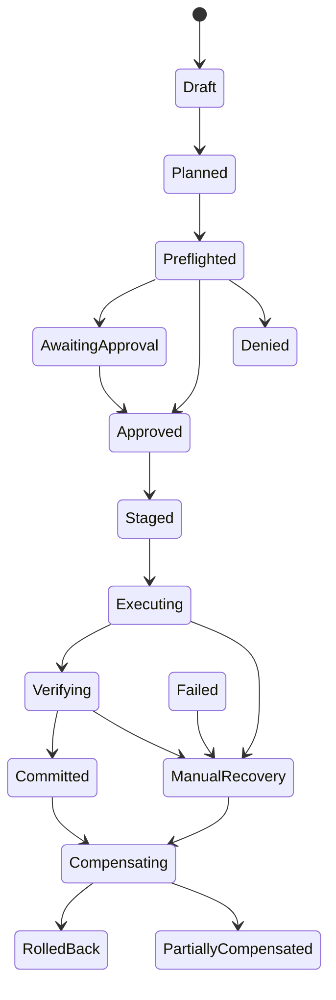

# Architecture

Veyra is a single-host transactional execution boundary. Its central design rule is that proposal,
authority, side effects, and evidence are separate responsibilities.

## Components and trust

`veyra-protocol` is below every component and defines the wire contract. Planners can propose an
effect but cannot issue a capability, approve a digest, select an adapter implementation, or invoke
one. Clients can request state transitions, but the kernel always re-evaluates structural, state,
capability, approval, and digest preconditions.

The current local API uses one administrative bearer, not separate agent and human identities. Its
holder can register principals, issue or revoke capabilities, and nominate a registered human when
granting an approval. The bearer-holding controller is therefore trusted for authority
administration even though it cannot fabricate a legal kernel transition or a passing verification.
Never expose that bearer directly to a planner; per-human cryptographic authentication is future
work.

Adapters are part of the trusted computing base: they receive permission to cross their effect
boundary after the kernel authorizes an effect. The bundled adapters constrain that power internally.
A third-party in-process adapter must be reviewed as privileged code.

## Transaction lifecycle

The complete graph also permits explicit cancellation and failure edges; the authoritative table is
`StateMachine::allows` in `veyra-core`. Every transition uses an optimistic snapshot revision and is
recorded atomically with durable state mutation. Invalid or stale transitions return typed errors.

## One execution

1. The kernel validates the intent and registered principal, asks the configured planner for a plan,
   then rejects unknown adapters, malformed effects, causal mismatches, and scope expansion.
2. Policy first checks live proposal-level authority. A denial is journaled without letting the
   adapter observe the target.
3. An authorized adapter performs side-effect-free preflight. Policy reevaluates the canonical effect
   containing that exact preview and returns deny, allow, or require-approval.
4. A human approval grant repeats the exact digest and single-use challenge nonce. The grant is
   durable, but the nonce is consumed only when execution begins.
5. Immediately before staging, the kernel revalidates capability status, aggregate use budgets,
   approval expiry, and effect digest. For each effect it atomically consumes capability uses and the
   optional approval nonce with audit evidence, then stages durable restoration data. Before crossing
   the external side-effect boundary it also reserves the idempotency key.
6. The adapter executes once and returns a bounded redacted result.
   The journal authenticates a receipt over that result.
7. Adapter verification observes target state and evaluates every expected postcondition. Only all-pass
   verification can transition to `committed`.
8. Rollback walks effects in reverse order and refuses to overwrite state that no longer matches the
   executed post-state. Mixed recovery reports `partially_compensated`.

## Persistence and recovery

SQLite uses WAL mode and full synchronous durability. Immutable protocol objects, revisioned
transaction snapshots, staged descriptors, capability uses, approval nonces, idempotency
reservations, and audit events share one database. Each audit event hashes canonical event content
plus the previous hash; a transactionally updated local count/head anchor also detects tail
deletion. Materialized transaction, immutable-object, capability, nonce, stage, and idempotency rows
are also bound back to audit payloads and checked in both directions. A gap, reorder, mutation,
missing materialized row, broken link, or anchor mismatch fails verification. Aggregate transaction
inspection is read from one SQLite snapshot so it cannot mix revisions during a concurrent update.

On startup, transactions are normalized from their last durable phase. Planned,
awaiting-approval, and approved work remains available through its normal guarded API. Incomplete
draft/preflight phases terminate without side effects. Staged, executing, verifying, or compensating
work is persisted as `manual_recovery`; Veyra will not guess whether authority, adapter evidence, or
an external effect is complete. An operator may inspect evidence and request non-clobbering rollback.
That operation recovers every durable stage it can bind to the plan; absent stage evidence is
reported as `partially_compensated` rather than blocking known recovery or claiming full restoration.

The per-transaction async lock prevents overlapping operations inside one daemon. SQLite revisions,
unique nonces, and unique idempotency keys provide durable conflict detection. Multiple daemon
processes sharing one database are outside the supported deployment model.

## Deployment

The standalone daemon and embedded Tauri host bind only loopback addresses and require a random
administrative bearer token. The data directory and filesystem workspace must have disjoint
canonical roots. The desktop webview receives connection material through a narrow Tauri command and
is protected by a restrictive CSP; it is therefore security-sensitive presentation code, not an
authority engine.

See [VEP-0001](../protocol/VEP-0001.md), the [threat model](../security/threat-model.md), and the
[ADRs](adr/) for normative detail and tradeoffs.
